# Plant Species Image Classification

## A. Project Overview
This project is an image classification system developed using Google Teachable Machine to identify 20 different flowering plant species based on images. The model was trained using 250 images per class for a total of 5,000 images.

## Brief Description of the Project
The goal of this project is to train a machine learning model that can recognize and classify plant species using image data. The dataset contains 20 ornamental and flowering plants collected from various sources.

## Purpose of the Image Classification Model
The purpose of this model is to provide automatic plant identification using images. It can be useful in education, gardening, agriculture, and botanical studies.

---

# B. Plant Species Section

## 1. Princess Flower
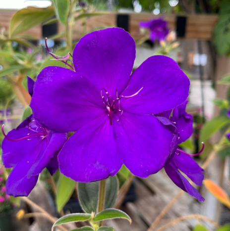

- Common Name: Princess Flower
- Scientific Name: Tibouchina urvilleana
- Description: A tropical shrub with large purple flowers.

## 2. Angel's Trumpet
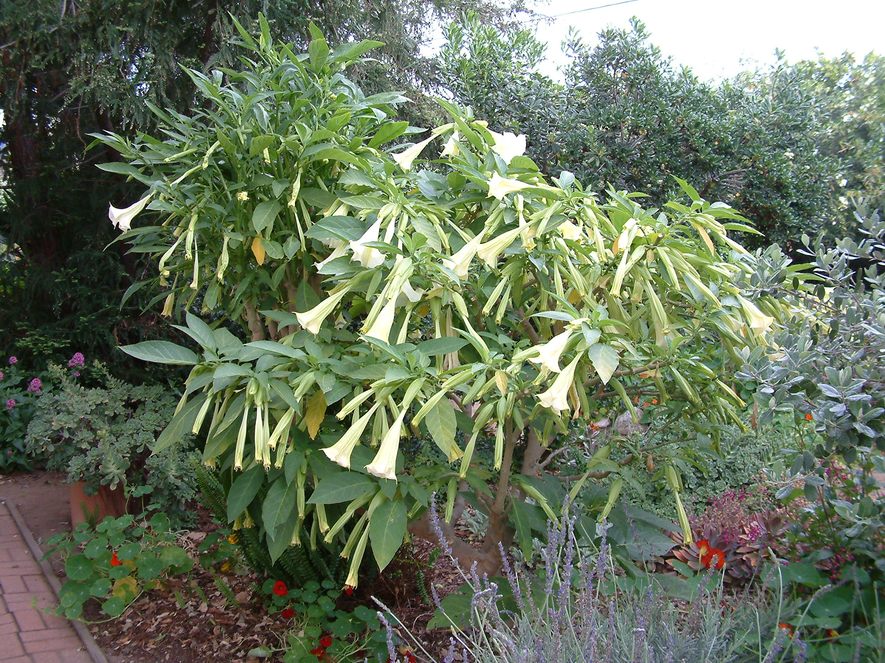

- Common Name: Angel's Trumpet
- Scientific Name: Brugmansia
- Description: A flowering plant with large trumpet-shaped blooms.

## 3. Bleeding Heart Vine
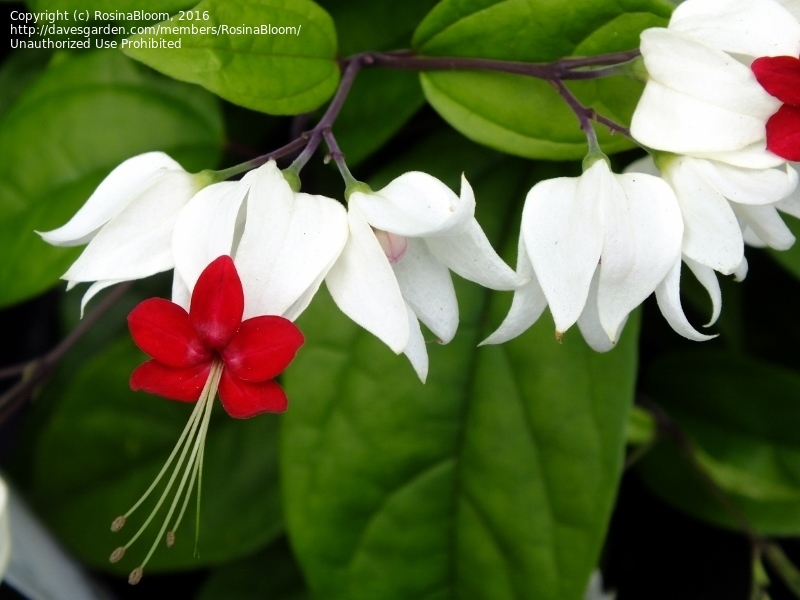

- Common Name: Bleeding Heart Vine
- Scientific Name: Clerodendrum thomsoniae
- Description: A vine plant with white petals and red centers.

## 4. Firecracker Plant
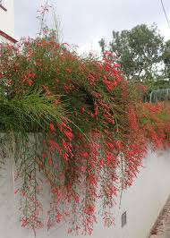

- Common Name: Firecracker Plant
- Scientific Name: Russelia equisetiformis
- Description: A shrub known for cascading red tubular flowers.

## 5. Bluesky Vine
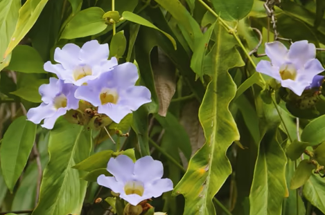

- Common Name: Bluesky Vine
- Scientific Name: Thunbergia grandiflora
- Description: A climbing vine with blue trumpet flowers.

## 6. Mandevilla
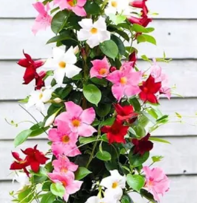

- Common Name: Mandevilla
- Scientific Name: Mandevilla sanderi
- Description: A tropical vine with pink or red flowers.

## 7. Golden Dewdrop
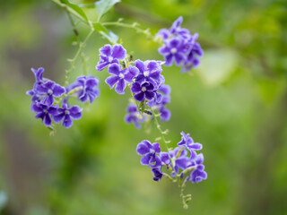

- Common Name: Golden Dewdrop
- Scientific Name: Duranta erecta
- Description: A shrub with purple flowers and yellow berries.

## 8. Mexican Petunia
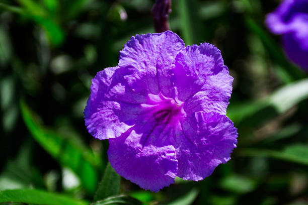

- Common Name: Mexican Petunia
- Scientific Name: Ruellia simplex
- Description: A flowering plant with purple blooms.

## 9. Firebush
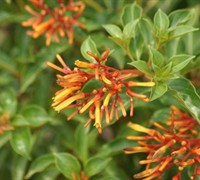

- Common Name: Firebush
- Scientific Name: Hamelia patens
- Description: A shrub with orange-red tubular flowers.

## 10. Coreopsis
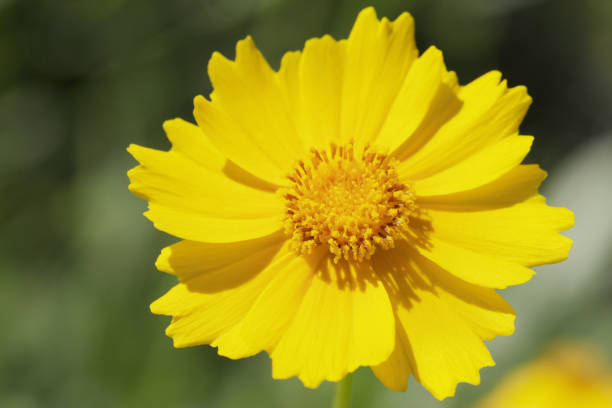

- Common Name: Coreopsis
- Scientific Name: Coreopsis tinctoria
- Description: A bright yellow daisy-like flowering plant.

## 11. Black Calla Lily
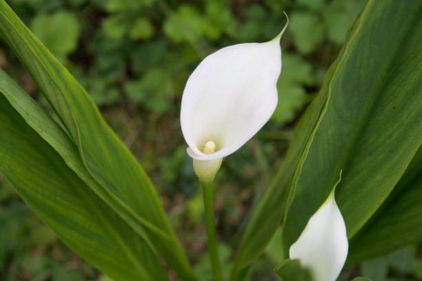

- Common Name: Black Calla Lily
- Scientific Name: Zantedeschia
- Description: An elegant dark-colored ornamental flower.

## 12. Blue Passion Flower
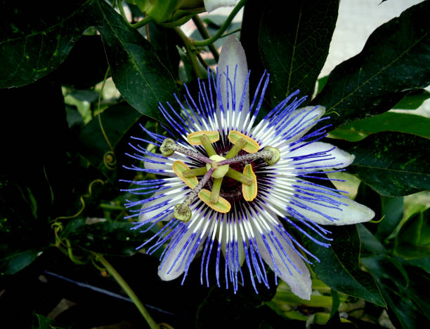

- Common Name: Blue Passion Flower
- Scientific Name: Passiflora caerulea
- Description: A vine with exotic blue and white flowers.

## 13. Moonflower
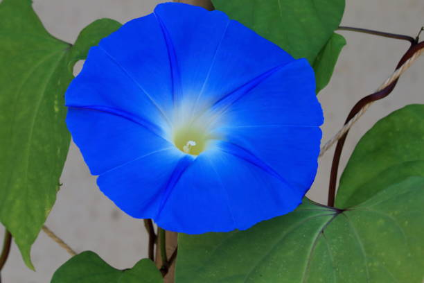

- Common Name: Moonflower
- Scientific Name: Ipomoea alba
- Description: A night-blooming vine with white flowers.

## 14. Flame Lily
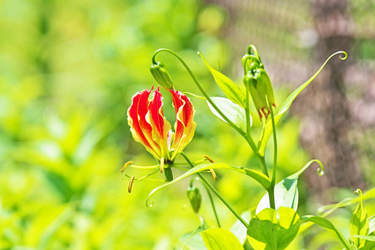

- Common Name: Flame Lily
- Scientific Name: Gloriosa superba
- Description: A climbing lily with flame-like petals.

## 15. Bird of Paradise

- Common Name: Bird of Paradise
- Scientific Name: Strelitzia reginae
- Description: A tropical plant with bird-shaped flowers.

## 16. Madagascar Periwinkle
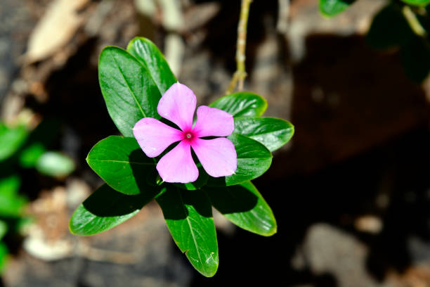

- Common Name: Madagascar Periwinkle
- Scientific Name: Catharanthus roseus
- Description: A medicinal flowering plant with pink blooms.

## 17. Cosmos bipinnatus
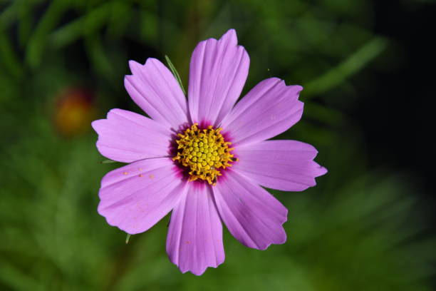

- Common Name: Garden Cosmos
- Scientific Name: Cosmos bipinnatus
- Description: A flowering plant with pink or white petals.

## 18. Cape Plumbago
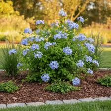

- Common Name: Cape Plumbago
- Scientific Name: Plumbago auriculata
- Description: A shrub with pale blue flowers.

## 19. Scarlet Sage
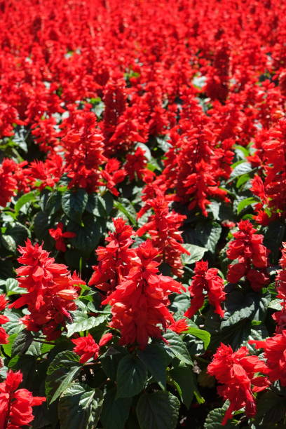

- Common Name: Scarlet Sage
- Scientific Name: Salvia splendens
- Description: A bright red ornamental flower.

## 20. Spider Flower
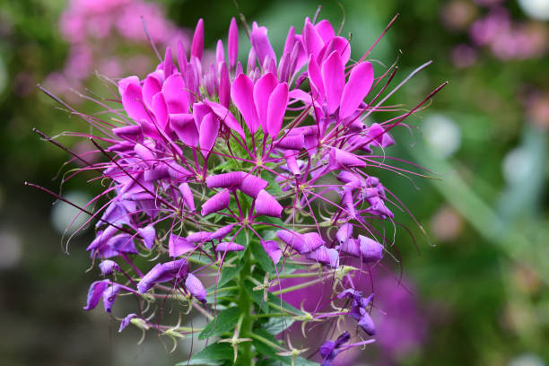

- Common Name: Spider Flower
- Scientific Name: Cleome hassleriana
- Description: A flowering plant with long protruding stamens.

---

# C. Model Training Details

- Epochs: 50
- Batch Size: 16
- Learning Rate: 0.001
- Images per Class: 250
- Total Images: 5,000

---

# D. Model Evaluation

## Confusion Matrix
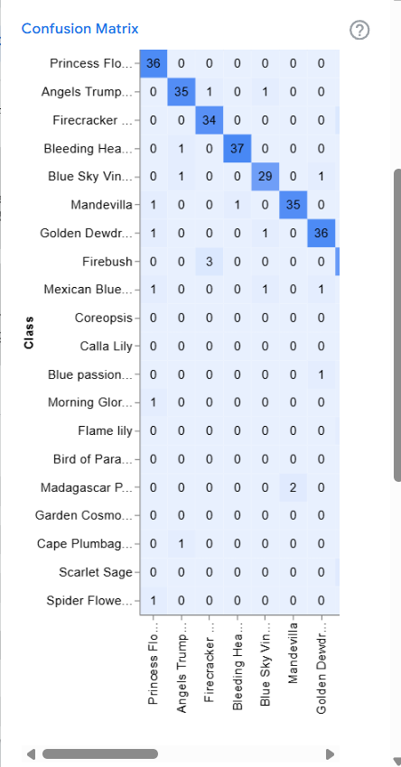

## Accuracy per Class
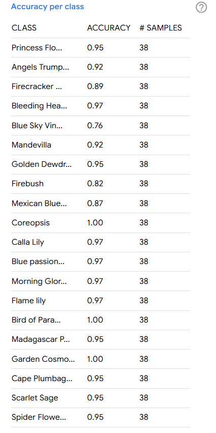

## Overall Accuracy

---

# E. Model Testing

## Test 1
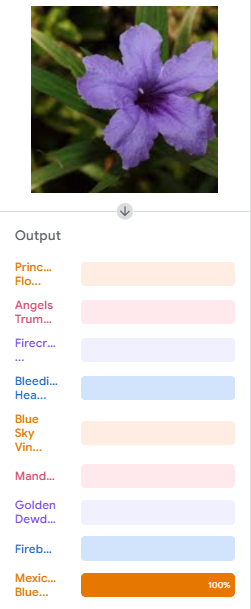

## Test 2
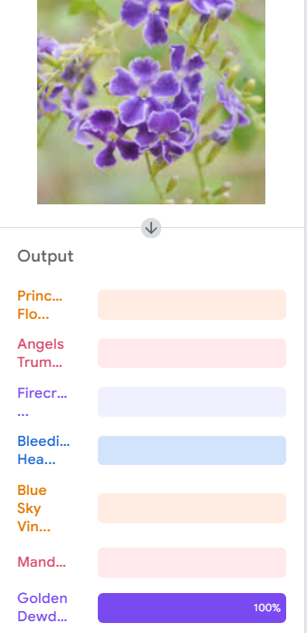

## Test 3
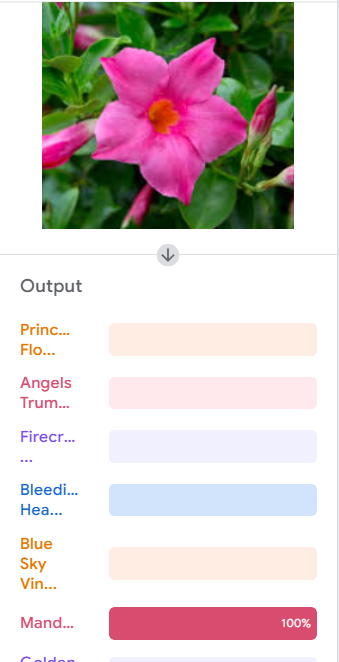

## Test 4
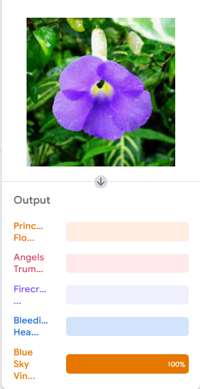

## Test 5
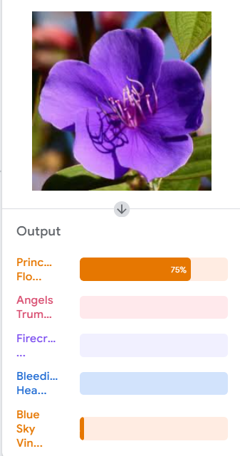

## Test 6
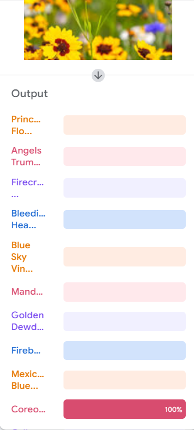

## Test 7
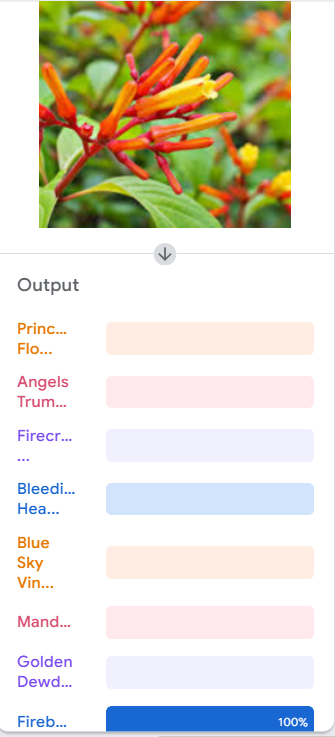

## Test 8
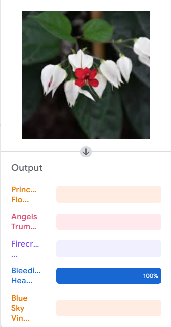

## Test 9
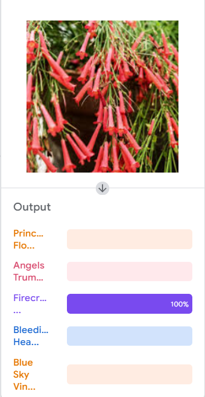

## Test 10
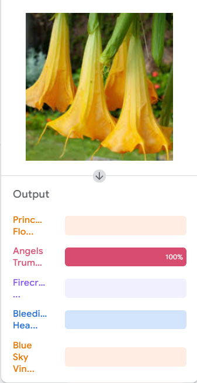

## Reflection Questions

### 1. How did the number of images per class affect your model’s accuracy?

Answer: From what I observed, the number of images really matters. The plant species that had more pictures (around 250–300) were much easier for the AI to recognize accurately. Classes with fewer images tended to get misclassified more often because the model didn't have enough data to learn the patterns. This taught me that a balanced and large dataset is key to getting a higher accuracy.

---

### 2. Which plant species were most commonly misclassified and why?

Answer: The plants that were most commonly mixed up were those that look almost the same, like Princess Flower and Mexican Petunia. The AI struggled to find the small differences because they have similar colors and shapes. I also noticed that some blurry photos or images with bad lighting made it harder for the model to give a correct prediction.

---

### 3. How did changing the epochs, batch size, or learning rate affect the training results?

Answer: 
-Epochs: Increasing the epochs helped the model learn better because it went over the data more times, but I had to be careful not to set it too high to avoid overfitting.

-Batch Size: Using a smaller batch size made the training feel more "stable," even if it took a bit longer to finish.

-Learning Rate: When I tried a higher learning rate, the training was fast, but it sometimes "skipped" the best results. Setting it to 0.001 was the "sweet spot" for me—not too fast and not too slow.  

Playing around with these settings helped me see how I had to balance the time it takes to train with how accurate the results actually get.

---

### 4. What challenges did you encounter during dataset collection and labeling?

Answer: 
-The biggest challenge was definitely the time it took to find 250 quality images for every single species. It was also hard to filter out images that weren't clear or had distracting backgrounds.
-Labeling was another tricky part because if I accidentally put an image in the wrong folder, it would confuse the model during training. It really showed me how important it is to have a clean and organized dataset.

---

### 5. If you were to improve your model, what specific changes would you make and why?

Answer:
- If I were to do this again, I would try to get at least 500 images per class to make the model even stronger. I would also make sure all images have consistent lighting and cleaner backgrounds. Lastly, I want to try "data augmentation" (like flipping or zooming the images) so the AI can recognize the plants from any angle. This would definitely help in making the predictions more reliable.
---

## Submission Checklist ✅

- [x] **20 related plant species proposed**  
  See [Section B: Plant Species Overview](#b-plant-species-overview) for details.

- [x] **Minimum 250 images per species**  
  Images are stored in the [`images/`](images/) folder.

- [x] **Model trained using Teachable Machine**  
  Training details are in [Section C: Model Training Details](#c-model-training-details).

- [x] **Under-the-hood evaluation screenshots**  
  Confusion matrix, per-class accuracy, and overall accuracy are in [Section D: Model Evaluation](#d-model-evaluation).

- [x] **10 preview testing screenshots**  
  See [Section E: Model Testing](#e-model-testing) for all screenshots.

- [x] **Model exported and saved**  
  Exported model files are in the [`models/`](models/) folder.

- [x] **GitHub repository with complete README.md**  
  You are currently viewing it here! ✅

- [x] **All files and screenshots uploaded and documented**  
  Check [`images/`](images/), [`models/`](models/), [`model_training_details/`](model_training_details/) and [`preview_test_images/`](preview_test_images/) folders for completeness.
